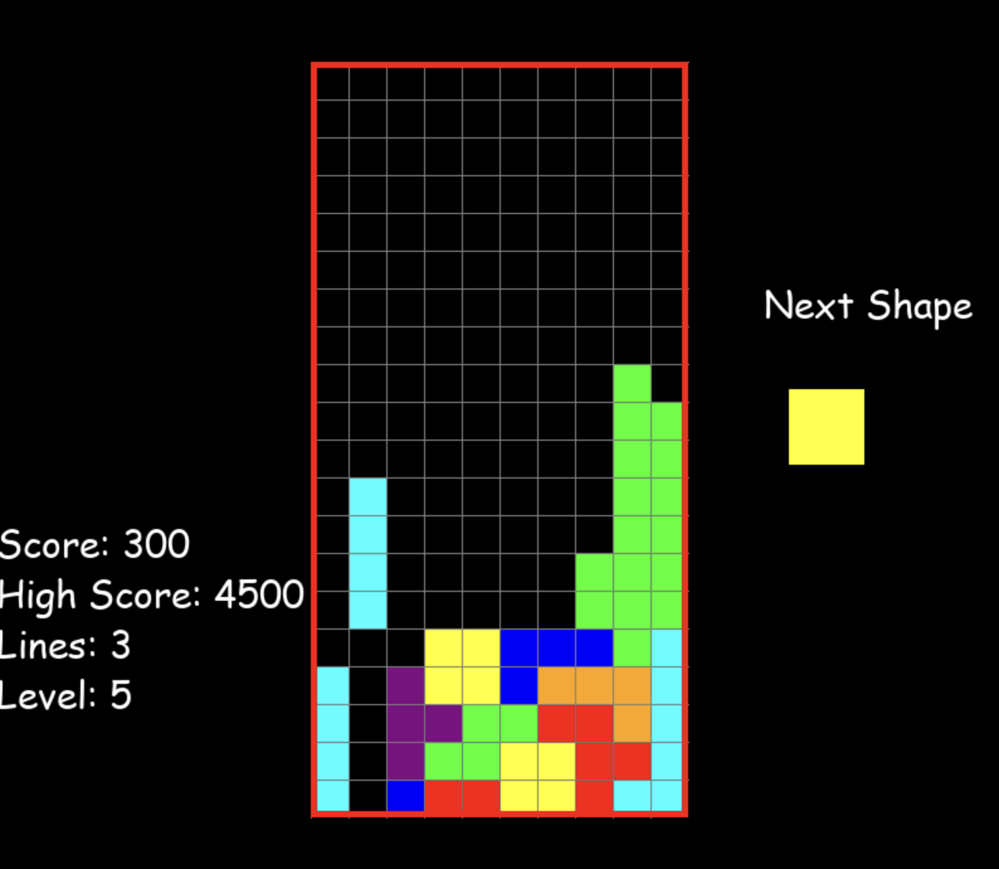

# Tetris Game

This is a simple Tetris game implemented in Python using the Pygame library. The game includes several features:

- **High Score Tracking**: The game saves the highest score achieved and displays it on the screen.
- **Level and Speed Increase**: As you clear more lines, the game level increases, and the pieces fall faster.
- **Pause Functionality**: Press 'P' to pause or resume the game at any time.
- **Lines Cleared Display**: The number of lines you've cleared is displayed.
- **Instant Drop**: Press the spacebar to instantly drop the current piece.

## Requirements

- Python 3.x
- Pygame library

## Installation

**Clone the repository:**

   ```bash
   git clone https://github.com/oscarhoffmann3487/tetris-game.git
    pip install pygame
```

Start the Game: Run the tetris.py script.

Controls:
- Left Arrow: Move the piece left.
- Right Arrow: Move the piece right.
- Up Arrow: Rotate the piece.
- Down Arrow: Move the piece down faster.
- Spacebar: Instantly drop the piece.
- P: Pause or resume the game.

